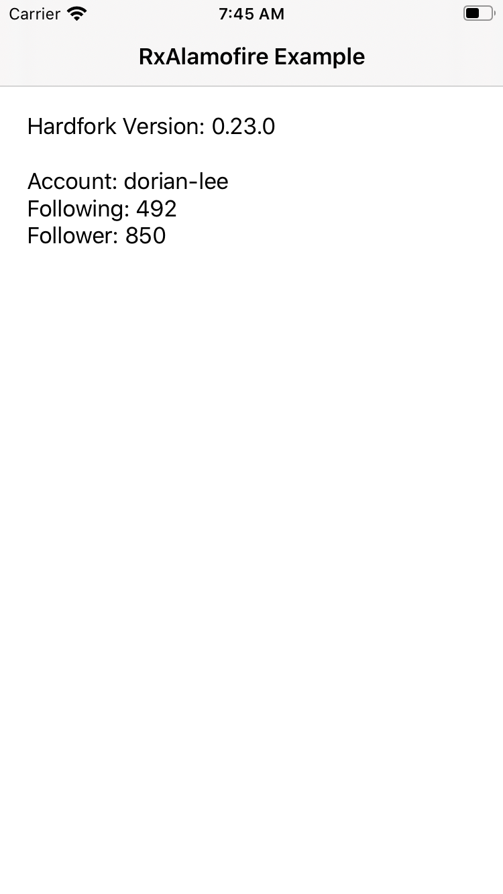

# Introduction

This project is an example of HTTP request and response using RxAlamofire in Swift.

---

# Description

This example demonstrates

* how to request hardfork version of Steem and follow count of an account using Steem API.

---

# Screenshot

</img>

